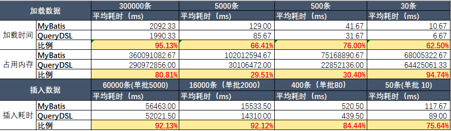

# querydsl-sql-extension

query-dsl-sql-extension is a enhancemant lib based on querydsl-sql module.

本框架是在 [querydsl-sql](https://github.com/querydsl/querydsl) 上的扩展，querydsl-sql的使用手册，可以参阅 http://querydsl.com/static/querydsl/latest/reference/html/ch02s03.html 

本框架是为了更便利，以及提供更高性能为目的对querydsl进行的改进。本框架通过初始化时使用不同的入口类的方式与原生的querydsl用法做出区别，保留原querydsl的更新能力，对原框架无侵入性。

## User Guide

```xml
<dependency>
	<groupId>io.github.xuse</groupId>
	<artifactId>querydsl-sql-extension</artifactId>
	<version>5.0.0-r104</version>
</dependency>
```

See file [文档](USER_GUIDE.md)

## 特性

### 提升使用便利性

* 提供@CustomType注解，支持将复杂的Bean映射到数据库字段中。
  **Example**

  ```java
      //Using a string type to mapping a column of timestamp in database.
      @CustomType(value=StringAsDateTimeType.class,parameters = "MM/dd/yyyy HH:mm:ss")
      private String updateTime;
  
      //The data is encrypted before insert into the database, and be decrypted while load from database.
      @CustomType(AESEncryptedField.class)
      private String phoneNumber;
  
  	//the field value will be serialzed to a json String before insert into the database, and v.v.
      @CustomType(JSONObjectType.class)
      private CaAsset asserts;
  ```

  

* 提供更多Batch Insert、Batch Update、Batch Delete操作。通过一个SQL Statment支持多组操作值，提升操作效率。

* 提供@AutoGenerated注解，用于一些字段的自动维护，如记录创建时间、更新时间、GUID、SnowFlake等数据写入。（该注解和数据库Default value或trigger等任何特性无关，是纯Java侧实现）

  **Example:**

  ```java
  	@AutoGenerated(GeneratedType.UPDATED_TIMESTAMP,writeback = true)
  	private Date updated;
  ```

  

* 提供增强的日志输出。通过com.github.xuse.querydsl.sql.log.QueryDSLSQLListener可以提供三种格式的日志输出格式，包括以下功能：

  * 输出每个SQL和参数，以及执行时间和记录数。如果日志级别到WARN，这部分逻辑可被跳过，以最大限度提升性能。
  * 慢SQL以Error级别输出（慢SQL阈值可设置）
  * Batch模式下，省略N组之后的参数。
  * 生产环境建议使用紧凑格式输出。语句和参数在一行中显示有利于使用grep等命令查询和分析。

  **Example:**

  ```java
  configuration.addListener(new QueryDSLSQLListener(QueryDSLSQLListener.FORMAT_DEBUG));
  configuration.setSlowSqlWarnMillis(200);
  ```
  
* 包扫描：前文中已经介绍了几种基于Annotation的功能增强，包扫描可以在应用启动时，分析所有数据库元模型定义，提前校验这些Annotation的正确性，并将其中的一些配置注册到全局上下文。@CustomType要生效需要提前进行包扫描。
  备注：早期版本使用 configuration.registerExType()方法注册实体，比较麻烦，新版本可以使用包扫描替代。


* 基于Annotation定义的元模型：QueryDSL原生的元模型（Metamodel）主要使用API进行定义。扩展提供了一套基于注解的元模型定义方式，效果覆盖原有的元模型和扩展功能。

  **Example**

  ```java
  @TableSpec(name="ca_asset",primaryKeyPath={"id"},collate = "utf8mb4_general_ci",
  keys = {
  		@Key(path= {"code"},type=ConstraintType.UNIQUE),
  		@Key(path= {"content"},type=ConstraintType.FULLTEXT),
  	}
  )
  @Comment("comments of this table.")
  public class CaAsset {
  	
  	@ColumnSpec(autoIncrement = true,type = Types.INTEGER,unsigned = true,nullable = false)
  	@Comment("primary key，auto increment.")
  	private int id;
  	
  	@ColumnSpec(type = Types.VARCHAR,size=64,nullable = false,defaultValue = "''")
  	@Comment("The code of asset. unique.")
  	private String code;
  	
  	@ColumnSpec(name="asset_name",size=128,nullable = false)
  	@Comment("The name of the asset.")
  	private String name;
  	
  	@ColumnSpec(size=16384)
  	@Comment("Asset's comments.")
  	private String content;
  ```
  
  通过上方示例，可以定义字段在数据库中的映射方式。对应的，元模型类中的部分代码可以省略，但需要增加一行代码使其自动扫描注解:
  
  **Example**
  
  ```java
  public class QCaAsset extends RelationalPathBaseEx<CaAsset> {
  	public static final QCaAsset caAsset = new QCaAsset("foo");
  	
  	public final NumberPath<Integer> id = createNumber("id", int.class);
  
  	public final StringPath code = createString("code");
  	
  	public final StringPath name = createString("name");
  	
  	public final StringPath content = createString("content");
  
  	public QCaAsset(String variable) {
  		super(CaAsset.class, PathMetadataFactory.forVariable(variable), "null", "CA_ASSET");
  		super.scanClassMetadata();   //这行代码使元模型在构造时自动扫描实体上的注解。
  	}
  ```
  
  
  

### 访问安全


* 防止一些误操作：这个其实是官方版本的自定义监听器的正常用法，通过SQL语句监听，阻止一些危险操作。比如下面的拦截器可以防止针对全表（不带Where条件）地执行Update或Delete操作。

  ```java
  configuration.addListener(new UpdateDeleteProtectListener());
  ```

* 防止个别慢SQL拖死整个数据库：可以设置全局的SQL请求超时时间，超时自动取消请求，防止请求长时间占用数据库资源。

  ```java
  configuration.setDefaultQueryTimeout(5); //设置SQL最大执行时间为5秒
  ```

  

### 性能优化

#### 无反射访问

重写了QueryDSL 中JavaBean与JDBC交互部分以提升性能。使用ASM，为每个需要Bean对应的查询字段组合生成了一个访问器，作为反射的一个加速替代。

动态类生成方案，每个一个SQL查询的SELECT 字段组合对应一个访问器，在第一次查询时生成并加载，第二次执行该SQL时性能就相当于硬编码。过程中去除了反射和IF分支，对ResultSet的全部访问均为按index的顺序访问（考虑CPU分支预测优化）。在内存操作次数较多的场合，性能超过某M 60%以上。

* 使用ASM7的动态类生成，支持JDK 8~ 22，GraalVM（22）。
* 在使用GraalVM native （AOT）模式下，ASM类生成无效，Java代码退化为基于反射的类型访问器，功能可正常使用。（在GraalVM编译期间，实质上这部分逻辑也已编译为本地静态代码，无需再使用ASM加速）

* 提供fetchSize, maxRows，queryTimeout等方法，操作大量数据时可根据业务需要做性能和安全的Tuning。

  **Example**：一次查出一百万ID。

  ```java
  List<Integer> list = factory.select(t1.id).from(t1)
  		.setFetchSisze(10000)
  		.setMaxRows(1_000_000)
  		.setQueryTimeout(15)
  		.fetch();
  ```
  
* 一些代码细节上的优化，减少内存拷贝和分配中的浪费。

性能对比（v4.2.1-r8）

两个典型场景测试。从相同的SQL从数据表中select数据；以及在相同的表中插入数据。对比MyBatis和QueryDSL-sql-extension.



备注：

* 相同的测试环境，相同的表和数据库。数据库:MySQL 5.7.26，无连接池。
* QueryDSL在测试数据加载时，通过`setFetchSisze(5000)`将单批获取大小调整到5000。MyBatis未找到此特性。
* 关于内存使用：QueryDSL的包扫描功能基于ASM对class文件内容解析的，分析文件结构确认需要加载后才会使用classLoader进行类加载。这种做法不会将未用到的类加载到虚拟机中。这可能是和MyBatis扫描的内存差别之一。

### 功能增强

#### 数据库结构建模

完整的数据库结构建模：扩展QueryDSL原生的ColumnMetadata，支持在Java(JDBC)模型中描述全部数据库表的特征——包括default value、unsigned、自增、索引、约束（不含外键）。相关模型可以通过元模型API创建，也可以通过注解来定义。

  Q: 有什么用？
  A: 数据库应用开发者一般有两种用法，一种是先在数据库中设计数据结构，然后通过Bean生成工具生成Java类结构。（称为数据库Schema优先）
  另外一种是软件开发者开发跨多种RDBMS应用的做法，是先建立Java Entity模型，然后通过程序等手段自动创建数据库结构。(称为Metadata优先)。
  QueryDSL仅支持第一种用法。本库满足了Metadata优先的场合，可以通过Java元模型反向更新数据库结构。 同时，这种更新支持基于数据库结构对比的增量更新，支持更新索引、约束、视图、等数据表结构。（不支持：外键、物化视图、索引组织表、函数、触发器、存储过程，由于这些特性很少在跨RDBMS应用中用到，暂无支持的必要。）

#### 纯POJO使用 (无QueryClass)

QueryDSL官方版本中操作数据库需要使用代码生成生成工具生成query class。本框架在该基础上作了一些增强，允许用户不创建QueryClass类，通过纯POJO加上若干注解来替代query class模型。并使用lambda表达式来表示表或列的模型。

#### 多种风格的低代码API

有朋友和我反馈说QueryDSL的操作风格就像用java API在编写SQL语句，虽然功能很强大，但是对于SQL初学者他们还是更习惯于类似JPA、Hibernate、Mybatis Mapper等工具提供的一个支持简单对象操作的Repository。
所以也将一些常用操作封装到了GenericRepository类，针对这些低代码需求者，简化日常CRUD操作。

> 以QueryDSL的强大的Query AST机制封装这样一个工具没有任何难度，过去在我看来是这业务层做的事情。
>很多朋友却更喜欢那种风格的API，后来我意识到并不是所有开发者都关注底层的AST和数据库衔接这些问题，他们更关注数据访问facade层，希望用更少的代码完成常用业务功能。所以包装了GenericRepository，以支持一些更偏向“传统习惯”的用法。  

#### 数据库结构访问与修改(DDL)

* 支持通过API查询数据库中的Schema、表、视图、索引、约束等信息。

* 支持Truncate/Create/Drop/Alter table/ Partition等常用DDL的Java语法操作。

#### record对象作为数据表映射

java 16开始支持 Record特性(**@jls** 8.10 Record Types)， 支持将这类对象作为数据表映射。代替传统的POJO实体Bean。详见quick start文档。

> 要使用Record特性，您必须使用JDK 16以上版本。
> 本框架对Record对象的访问作了特殊处理，不依赖JDK 16以上版本，当前框架编译后依然可以在java 8上使用。


### 运行环境与适用范围

**Java环境支持**

* Open JDK / Oracle  JDK 8~22 
* Oracle GraalVM 17~22
* GraalVM Native (AOT)

未测试不确定

* Andriod (ASM功能会自动禁用，但其他特性未进行验证)

**数据库支持(DML)**

保持QueryDSL原版能力，包含以下数据库

* MySQL v5.x ~ v8.x
* CUBRID
* DB2 10.1.2  and above
* Apache Derby 10.14  and above
* Firebird
* H2
* HSQLDB
* Oracle 10g  and above
* PostgreSQL 9.1 and above
* Teradata
* SQL Server 2005, 2008, 2012
* SQLite 

> 其他数据库可以自行编写SQLTemplates进行扩展 。

**数据库支持(DDL)**

* MySQL 5.6 and above
* Apache Derby 10.14 and above

支持DDL需要编写各个不同数据库的方言，目前整个方言的框架机制有了，但只编写完成了MySQL和Derby。下一个考虑抽空完成PostgresSQL的，剩下的看需要吧。
> 其他数据库可以自行编写SQLTemplatesEx (本框架定义的方言扩展类) 进行扩展 ，如有需求也可以邮件与我讨论。

### 业务层分表支持

> 本框架不提供分库分表功能

但有一种情形，当分表规则和用法较为简单，业务层希望自行封装分表时，需要能根据业务数据动态变化表名。针对这种情形，提供了一个允许业务代码自行调整表名的机制。

```java
	//定义本次操作中的表名后缀
	TableRouting routing=TableRouting.suffix( "2024Q2");

	//在DDL中操作带后缀的表名（删表建表）
	SQLMetadataQueryFactory metadata=factory.getMetadataFactory();
	metadata.dropTable(t2).withRouting(routing).execute();
	metadata.createTable(t2).withRouting(routing).execute();
	
	//在DML中操作带有后缀的表名
	List<Tuple> tuples=factory.select(t2.content,t2.code).from(t2)
	    .withRouting(routing)
	    .where(t2.name.eq("Test"))
	    .fetch();
	
	//如果在一个SQL中有多张表需要调整后缀，参考下例
	TableRouting routing=TableRouting.builder()
		.suffix(t1,"202406")
		.suffix(t2, "2024Q2")
		.build();
```

> 如果分库分表规则较为复杂，建议使用Sharding JDBC/Sharding Sphere等专用框架。

## 实验性功能

> 试验性功能是根据特定使用场景或建议增加的一些新特性，用于体验和建议收集。

### Partition管理（目前仅支持MySQL的方言）

代码示例

```java
SQLMetadataQueryFactory metadata=factory.getMetadataFactory();
metadata.createTable(t1).reCreate().execute();

QPartitionFoo1 t1 = QPartitionFoo1.partitionFoo1;
//创建分区
metadata.createPartitioning(t1)
		.partitionBy(Partitions.byHash(HashType.HASH, "TO_DAYS(created)", 4))
		.execute();

//查询表分区信息
List<PartitionInfo> list=metadata.getPartitions(t1.getSchemaAndTable());

//清除分区设置（不删除数据）
metadata.removePartitioning(t1).execute();

//创建按时间范围进行的分区
metadata.createPartitioning(t1).partitionBy(
	Partitions.byRangeColumns(t1.created)
		.add("p202401", "'2024-02-01'")
		.add("p202402", "'2024-03-01'").build())
    .execute();

//在按上述分区中再追加一个分区，
//该操作会自动使用REORGANIZE PARTITION将落在原先第一个分区内的数据移动到新分区
metadata.addParition(t1)
		.add("p20200101", "'2021-01-01'")
		.execute();

//删除分区（连同分区内的数据）
metadata.dropPartition(t1)
    .partition("p20200101").execute();
```

### DDL Support

> 实验性功能，个人精力有限目前仅完成了MySQL 和 Derby的方言适配。但现有框架基于AST的扩展机制十分强大，适配其他主流数据库问题不大，有兴趣者可自行编写方言进行扩展。

相关说明参见文档 quick_start.md

### MySQL Online DDL

OnLine DDL可以防止DDL执行期间锁导致阻塞,影响用户的 DML 操作,而 Online DDL 指的是在 DDL 期间,允许用户进行 DML 操作。

在MYSQL数据库上执行DDL时会自动使用Online方式执行，尽可能避免对生产环境业务访问的干扰。
示例如下：在对数据表进行修改时，会指定算法和锁，使得DDL执行期间不影响业务。

```sql
ALTER TABLE table1
  CHANGE c_bin c_bin BLOB NULL COMMENT 'test column', ALGORITHM = INPLACE, LOCK = NONE,
  DROP KEY idx_aaa_taskstatus, ALGORITHM = INPLACE, LOCK = NONE,
  ADD KEY idx_aaa_taskstatus (task_status), ALGORITHM = INPLACE, LOCK = SHARED
```

* （此功能的应用并不意味着DDL执行对数据表无影响，24小时的运行的高可用系统还是应当在业务低谷期间执行DDL）
* Online DDL是在MySQL 5.x引入的，8.x中支持更多的Online DDL策略。但目前5.x和8.x的方言还没有区分开，目前仅按5.x做了相对保守的策略。


### 动态变化的数据库表

> 当数据库表字段是动态定义时，无法用Java类来创建静态的表和字段模型。

1. 定义动态表模型

```java
//定义一个动态的表模型
DynamicRelationlPath table = new DynamicRelationlPath("t1", null, key);
//创建各列的模型
Path<Long> id=table.addColumn(Long.class, ColumnMetadata.named("id").ofType(Types.BIGINT).notNull())
		.with(ColumnFeature.AUTO_INCREMENT).unsigned().comment("主键ID")
		.build();
		
Path<String> name=table.addColumn(String.class,ColumnMetadata.named("name").ofType(Types.VARCHAR)
		.withSize(256).notNull())
		.defaultValue("")
		.build();
		
Path<Integer> status=table.addColumn(Integer.class, ColumnMetadata.named("status")
		.ofType(Types.INTEGER).notNull())
		.build();
			
Path<Date> created=table.addColumn(Date.class,ColumnMetadata.named("create_time")
		.ofType(Types.TIMESTAMP).notNull())
		.withAutoGenerate(GeneratedType.CREATED_TIMESTAMP)
		.build();

//创建主键
table.createPrimaryKey(id);
//创建索引
table.createIndex("idx_table_name_status", name, status);
...
```

2. DDL：建表

```java
DynamicRelationlPath table=getModel("dyn_entity_apple");
factory.getMetadataFactory().createTable(table).ifExists().execute();
```

2. DML：数据访问

```java
DynamicRelationlPath table=getModel("dyn_entity_apple");
Tuple o = table.newTuple(null,"张三",2,null);
//Add
factory.insert(table).populate(o).execute();

//Update
Map<String,Object> bean=new HashMap<>();
bean.put("id", 3);
bean.put("name", "李四");
Tuple u = table.newTuple(bean);
factory.update(table).populate(u, true).execute();
		
//Delete
factory.delete(table).populatePrimaryKey(u).execute();
		
//Query
SimpleExpression<String> name = table.path("name", String.class);
SimpleExpression<Long> id = table.path("id", Long.class);
SimpleExpression<Integer> status = table.path("status", Integer.class);

List<Tuple> tuples=factory.select(id,status).from(table).where(name.eq("张三")).fetch();
```


## 修订记录

**版本编号方式：** 版本号由两部分组成，前一个数字是对应的querydsl库版本号，后一个是此扩展框架的修订号。从1开始向上，每个修订都向下兼容。

```
v{querydsl 版本号} - r(extension version)
```

### v5.0.0-r104

2024-08-08

* 支持GraalVM的Native模式（AOT）使用
* 支持java 16以上的record类型作为实体。

### v5.0.0-r102

2024-07-24

* 按包整理javadoc，部分类更换包位置。补充重要类的双语javadoc。
* 支持外部扩展自行实现Facade。通过自行实现ExtensionQueryFactory接口，扩展各种查询API。
* 提供GenericRepository类，在Spring下可以继承该类后无需编写任何代码实现常用repository的功能。支持多种API风格。
* 【实验性】支持无Query Class的纯POJO映射使用。使用Bean Class代替QueryClass。使用方法引用Lambda代替模型字段。

### v5.0.0-r101

2024-06-28

* 增加了一个供上层业务调整表名的机制，以支持业务层分表场景。
* 支持MySQL Partition管理。支持RANGE/LIST/HASH/KEY等分区类型，支持分区的创建，调整，删除，重组等操作。
* 补充表约束和索引的缺失接口。部分操作MySQL支持不锁表的Online操作。

### v5.0.0-r100

2024-06-11

* 完成DDL相关表语法支持。部分类名重构调整。
* 版本号100开始，保持三位数。QueryDSL官方版本5.1.0是需要Java 11以上的，目前还不打算跟进支持。 

### v5.0.0-r8

* 升级支持Querydsl v5.0.0
* 添加MySQL方言：com.querydsl.core.types.dsl.MySQLWithJSONTemplates、JsonExpressions等，支持JSON字段操作
* 注解@AutoGenerated，支持字段内容自动生成(在update/insert时)。如使用populate()方法则自动写入，如使用set()方法，可调用populateAutoGeneratedColumns()方法生成。
* 增加GUID、SnowFlake ID等生成规则

### v4.1.1-r4
* 增加更适合于linux下的简洁日志。
* 结果集拼接性能优化。提供额外的RelationalPathBaseEx用于继承。
* API增加——增加DDL语法框架（尚未实现）。

### v4.2.1-r1
1. 日志扩展
2. 关于Connection is not transactional异常修复，还有一些其他方面的个性化要求，因此通过本项目进行扩展。后续随功能更新。

## FAQ

1. 关于SQL语句的换行影响日志查看，在创建SQLTemplate的时候就使用
 com.querydsl.sql.SQLTemplates.Builder.newLineToSingleSpace()方法来实现。

2. 如果我的项目已经用了querydsl-sql，现在集成这个框架，需要将原有的query class全部修改为继承`com.github.xuse.querydsl.sql.RelationalPathBaseEx`类吗？

    A: 可以不用。本框架是在querydsl上的一些轻微调整格改进，querydsl的原生用法都不受影响。

## 其他

### 什么是元模型

* 元模型(meta mode)：在QuerDSL中，对每个实体会有一个"Q"开头的class，在querydsl文档中，称为 `query classes`. 其实这个类和JPA中的元模型差不多，都是用于描述数据结构，并且提供查询API引用的类。（在OpenJPA中，会生成下划线结尾的类，用途是差不多的）。所以本文某些场合也会使用元模型一词，和QueryDSL文档中的 query class是一个东西。

### 写这个框架

可以说是无心偶得，佛系维护。

* 开始 (2017)
近日使用QueryDSL-sql作为轻量级数据库操作框架，有着手写SQL的畅快，又有静态语法检查的安心，还有语法自动完成的高效。
但是日志功能稍有不满，SQLDetailedListener中不能监听到所有的SQL参数、执行时间、影响记录数等信息。
所以本着最小修改的原则，用这个项目对QueryDSL的监听行为进行扩展，从而可以得到更详细的日志信息。

* 性能演进（2018）
对性能进行了优化。除了代码细节修改外，还增加了基于ASM自动生成动态类来完成字段拼装对象，无反射调用。

* 后来（2019~2023）

  之后就是自己用得非常爽快，期间仅对一些常用的功能进行了小改，使得代码更简洁。如自动时间戳、自动生成GUID等。

* 再后来(2024)
在使用过程中，阅读源码中发现原作者一开始是想要支持DDL语法的，后来不知道为什么没有再支持了。可能确实使用场景不太多，总归有点小缺憾，由于我早年在别的框架上写过相关的功能，于是花了不少时间在目前的框架上支持了DDL语法。